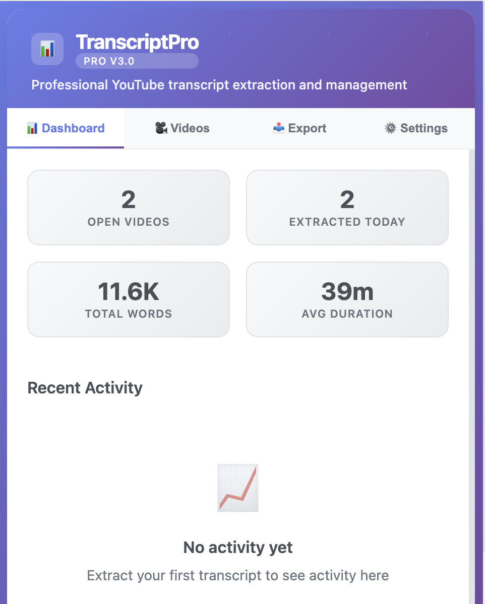
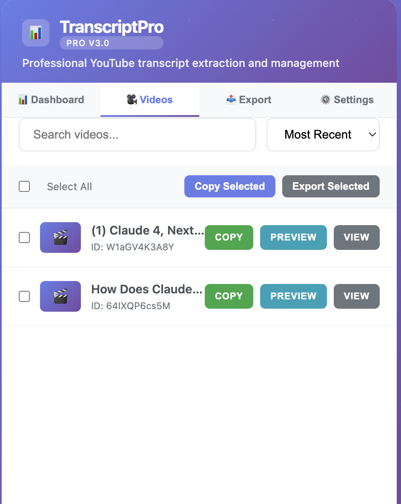
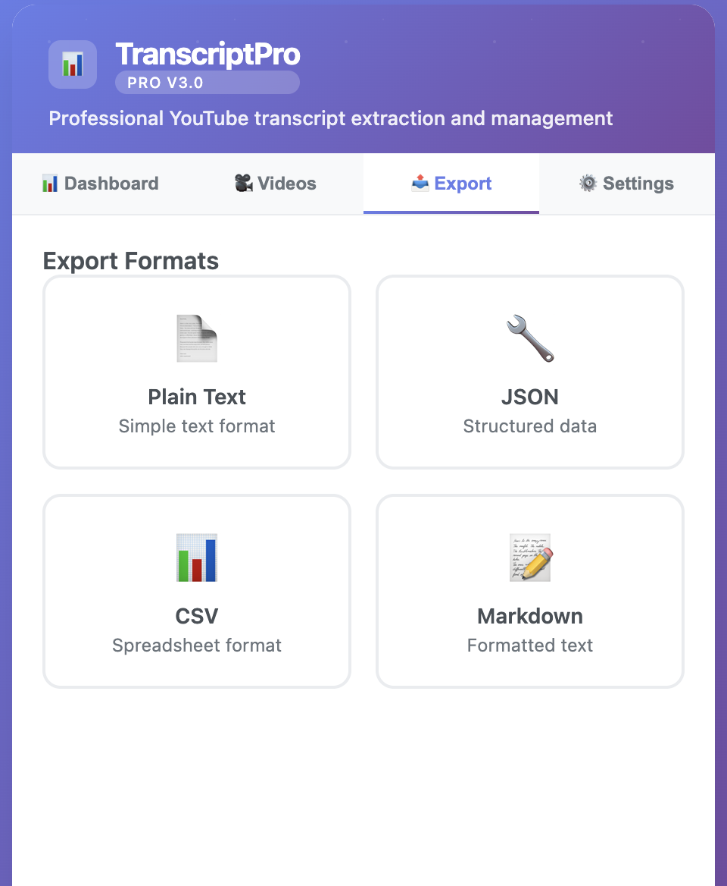
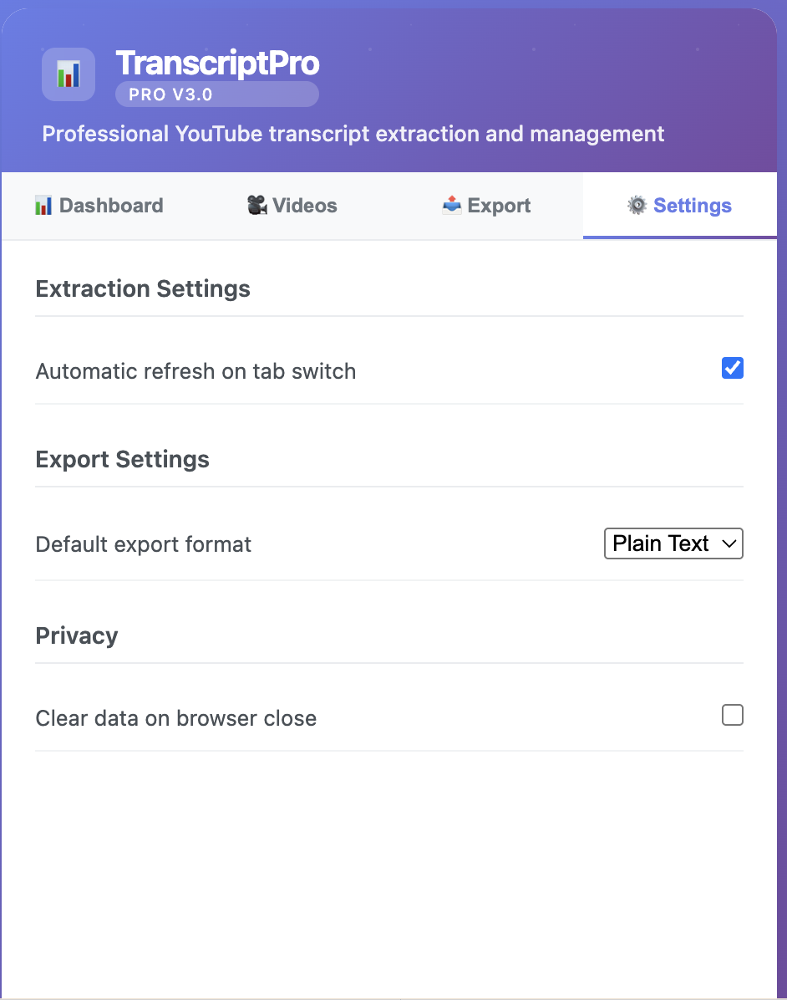

<div align="center">

# 🎥 YouTube Transcript Pro

🚀 **Professional Chrome extension for extracting, managing, and exporting YouTube video transcripts with advanced features and bulk operations.**

[](LICENSE)

</div>

## 📸 Screenshots

### 📊 Dashboard Overview

The main dashboard provides a comprehensive overview of your transcript extraction activity. View key metrics including open videos count, daily extraction stats, total word count, and average video duration. The Recent Activity section tracks your extraction history with visual analytics.

### 🎬 Video Management

Efficiently manage all your extracted video transcripts in one place. The Videos tab displays a searchable list of all processed videos with their titles and YouTube IDs. Use bulk operations to select multiple videos for copying or exporting, with individual actions available for each transcript (Copy, Preview, View).

### 📤 Export Options

Choose from multiple professional export formats to suit your needs:
- **Plain Text**: Simple, clean text format for basic use
- **JSON**: Structured data format for developers and automation
- **CSV**: Spreadsheet-compatible format for data analysis
- **Markdown**: Formatted text with proper structure and styling

### ⚙️ Settings & Configuration

Customize your experience with comprehensive settings:
- **Extraction Settings**: Enable automatic refresh when switching between YouTube tabs
- **Export Settings**: Set your preferred default export format
- **Privacy Options**: Configure data clearing preferences for enhanced privacy

## ✨ Features

- 🎯 **One-click transcript extraction** from any YouTube video
- 📦 **Bulk operations** - extract multiple videos simultaneously
- 👁️ **Real-time video detection** across all browser tabs
- 📊 **Professional dashboard** with analytics and statistics
- 📄 **Multiple export formats** - Plain Text, JSON, CSV, and Markdown
- 🔍 **Advanced filtering** - search and sort videos by title, date, or duration
- ⬇️ **Bulk export capabilities** - download multiple transcripts at once
- ⚙️ **Settings management** - customize auto-refresh and default formats
- ⌨️ **Keyboard shortcuts** - Quick access with `Ctrl+Shift+T` (Windows) / `Cmd+Shift+T` (Mac)

## 🔧 Installation

1. **📥 Download the extension**
   ```bash
   git clone https://github.com/yourusername/YoutubeTranscriptPro.git
   cd YoutubeTranscriptPro
   ```

2. **🔗 Load in Chrome**
   - Open `chrome://extensions/`
   - Enable "Developer mode" (top-right toggle)
   - Click "Load unpacked"
   - Select the project folder
   - Extension icon will appear in toolbar
